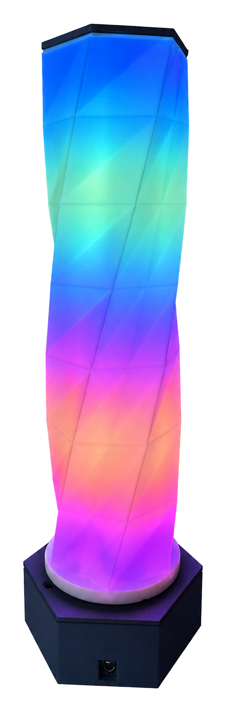
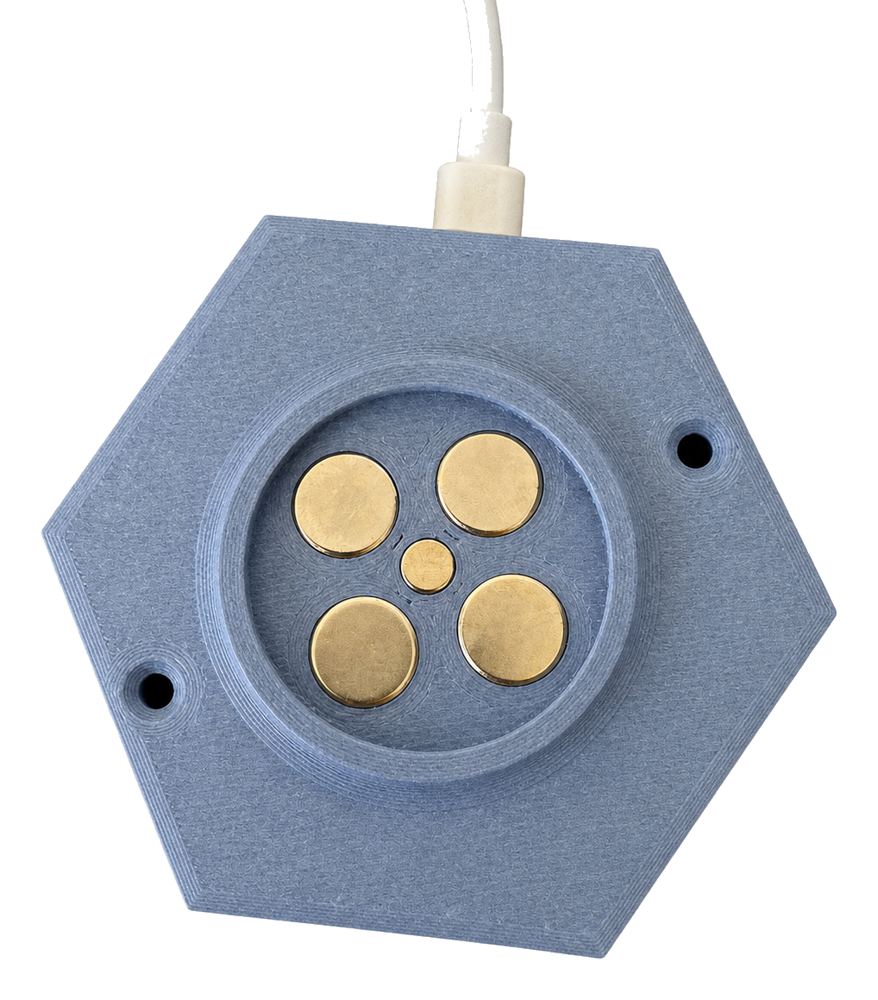
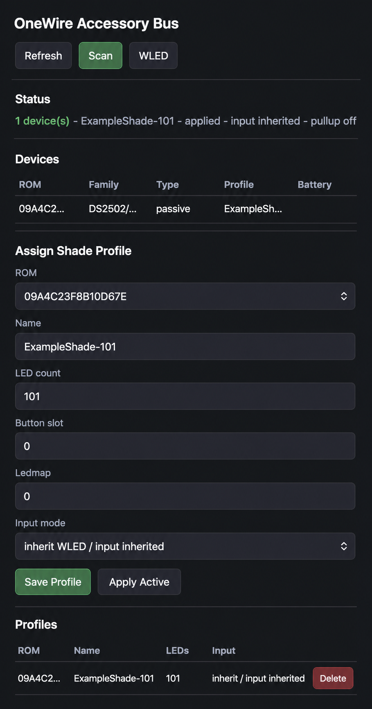

# WLED OneWire Accessory Bus Usermod

Unofficial beta WLED usermod for removable lamp shades and accessory modules identified through one additional OneWire data contact.

The validated path uses passive OneWire ROM chips and learned profiles for LED count, ledmap, and button/touch behavior. A conservative draft protocol prepares future battery, sensor, and smart-shade microcontrollers. AudioReactive can be built alongside the Usermod.

This community project is not affiliated with or endorsed by the WLED project.



## Status

- Target: ESP32 WLED builds.
- Hardware-tested: passive DS2502, GPIO19, external 4.7 kOhm pullup to 3.3 V, approximately 20 cm bus.
- Software capacity: eight stable devices and eight profiles; the ESP32 worker enumerates the complete bounded set outside WLED's main loop.
- Smart accessories: protocol draft; independent slave HIL is still pending.
- Beta 2 was remediated after the 2026-07-16 audit and 2026-07-17 re-audit.
- A pre-release privacy reset replaced the public Git history with one reviewed root commit; withdrawn predecessor tags and assets are intentionally not retained.
- Current prerelease: [`v0.1.0-beta.2`](https://github.com/Fxxrz/wled-onewire-accessory-bus/releases/tag/onewire-accessory-bus-v0.1.0-beta.2), published from the pinned clean build and documented passive-device smoke test.

## Repository Layout

```text
usermods/onewire_accessory_bus/
  library.json
  onewire_accessory_bus.cpp
  onewire_accessory_protocol.h
  onewire_accessory_protocol.test.cpp
  onewire_accessory_bus.test.js
  smoke-test.js
  readme.md
  docs/
```

The folder uses underscores because it is ready to copy into WLED's normal `usermods/` layout.

## Start Here

- [Usermod guide](usermods/onewire_accessory_bus/readme.md)
- [Hardware and safety boundary](usermods/onewire_accessory_bus/docs/hardware.md)
- [JSON API contract](usermods/onewire_accessory_bus/docs/json-api.md)
- [MQTT and Home Assistant](usermods/onewire_accessory_bus/docs/mqtt-homeassistant.md)
- [Smart protocol draft v1](usermods/onewire_accessory_bus/docs/smart-accessory-protocol.md)
- [Audit disposition](usermods/onewire_accessory_bus/docs/REVIEW_AUDIT_2026-07-16.md)
- [Re-audit disposition](usermods/onewire_accessory_bus/docs/REVIEW_REAUDIT_2026-07-17.md)
- [Release build definition](RELEASE_BUILD.md)
- [Security policy](SECURITY.md)

## Source Build

Copy `usermods/onewire_accessory_bus` into a WLED checkout and use the included [PlatformIO example](examples/platformio_override.example.ini):

```sh
pio run -e esp32dev_onewire_audio
```

The same Usermod source is built against the exact WLED revision pinned in [RELEASE_BUILD.md](RELEASE_BUILD.md). No WLED core file is modified.

PlatformIO `firmware.bin` is an OTA/app image, not a universal bare-device image. Do not flash it at an arbitrary offset. A future factory asset must be a merged image with exact board, flash, partition, offset, and recovery instructions.

## Tests

Node.js 18+, Python 3, and a C++ compiler with AddressSanitizer/UndefinedBehaviorSanitizer support are required. The first command runs native parser tests both normally and under the sanitizers, negative packaging tests, and source-level integration contracts.

```sh
node usermods/onewire_accessory_bus/onewire_accessory_bus.test.js
pio run -e esp32dev_onewire_audio
node usermods/onewire_accessory_bus/smoke-test.js http://wled.local 09000000000000CC
```

The smoke test requires an expected CRC-valid ROM. Set `OWAB_ALLOW_EMPTY=1` only for an intentional clean-empty test and `OWAB_SETTINGS_PIN` when WLED settings are locked.

## Images



Hardware photos are edited cutouts of the reference lamp. The following three UI assets are anonymized, AI-generated illustrative mockups and are not evidence of a live hardware test:

- `onewire-manager-profile.png`
- `wled-info-onewire-status.png`
- `wled-usermod-settings-onewire.png`



## License And Notices

The project is distributed under the WLED licensing basis, EUPL-1.2-or-later. See [LICENSE](LICENSE). It contains modifications for the OneWire Accessory Bus dated 2026.

The direct `paulstoffregen/OneWire` dependency and its notices are listed in [THIRD_PARTY_NOTICES.md](THIRD_PARTY_NOTICES.md). Firmware releases must additionally publish the exact corresponding WLED source/build definition, complete generated dependency inventory/SBOM, and notices for all linked components.
